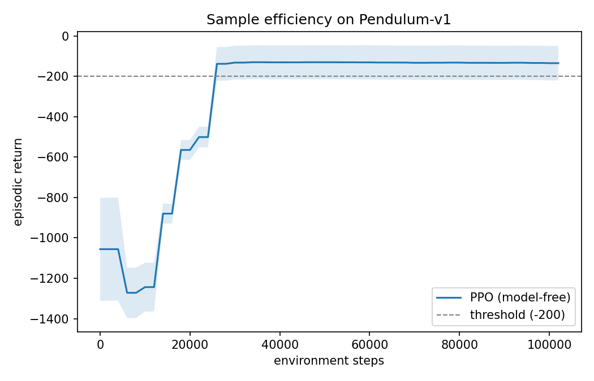

# Pendulum-v1: model-based RL vs. a PPO baseline

Solving `Pendulum-v1` with **model-based RL (PETS: probabilistic dynamics
ensemble + CEM model-predictive control)**, using **model-free PPO** purely as
a comparison baseline on five metrics: sample efficiency, environment steps to
a return threshold, training wall-clock time, inference time per action, and
final episodic return.

> **Status: stage 1 of 2.** The PPO baseline is implemented and measured. The
> PETS agent and the write-up of the model-based approach come next; this
> README will then report the MBRL method, with PPO appearing only in the
> comparison table below.

## Setup

```bash
.venv/bin/pip install -r requirements.txt
```

## Run

```bash
.venv/bin/python -m src.ppo_train        # PPO baseline, settings from config/ppo.yaml
.venv/bin/python -m src.compare --plot   # comparison table + sample-efficiency figure
```

Run from the repo root (config and output paths are relative). All settings
live in `config/*.yaml` — `config/ppo.yaml` inherits the shared evaluation
protocol from `config/base.yaml`. Training curves go to Weights & Biases;
`--no-wandb` turns that off.

## Watching the agent

**Live window while it trains** — renders the periodic evaluation episodes, so
you see the policy improving:

```bash
.venv/bin/python -m src.ppo_train --watch --eval-episodes 1
```

**Saved videos** — SB3's `VecVideoRecorder` writes a clip of the training envs
every `video.every_env_steps` (20k default) to
`results/<algo>/seed<n>/videos/`, and wandb picks them up automatically.
Because it renders inside `model.learn()`, it does add to `train_wall_clock_s`
— use `--no-video` for runs you quote timings from (the table above was
produced that way).

## How the comparison is kept fair

- Both agents are evaluated by the same code (`src/evaluate.py`) on the same
  eval seeds, so they face identical initial states.
- Sample efficiency is measured in **real environment steps**. Model rollouts
  inside PETS are not env steps; evaluation steps are excluded from the budget.
- Evaluation time is excluded from `train_wall_clock_s` (see `PausableTimer`),
  so wall-clock does not depend on how often we evaluated.
- PPO uses the tuned rl-baselines3-zoo hyperparameters for `Pendulum-v1`
  unmodified — the baseline is a fair one, not a strawman.
- Both run on the same device (RTX 3090); the device used is recorded in each
  `metrics.json`.

## Results

The PETS column lands in stage 2; the baseline is measured and recorded in
`results/ppo/seed0/metrics.json` (seed 0, threshold −200, 100k step budget).

| Metric | PPO (model-free) |
| --- | --- |
| Final return (mean over 20 eval episodes) | −141.5 ± 99.1 |
| Env steps to return ≥ −200 | 26,000 |
| Env steps trained | 102,400 |
| Training wall-clock | 80.9 s |
| Inference | 0.525 ms / action |


